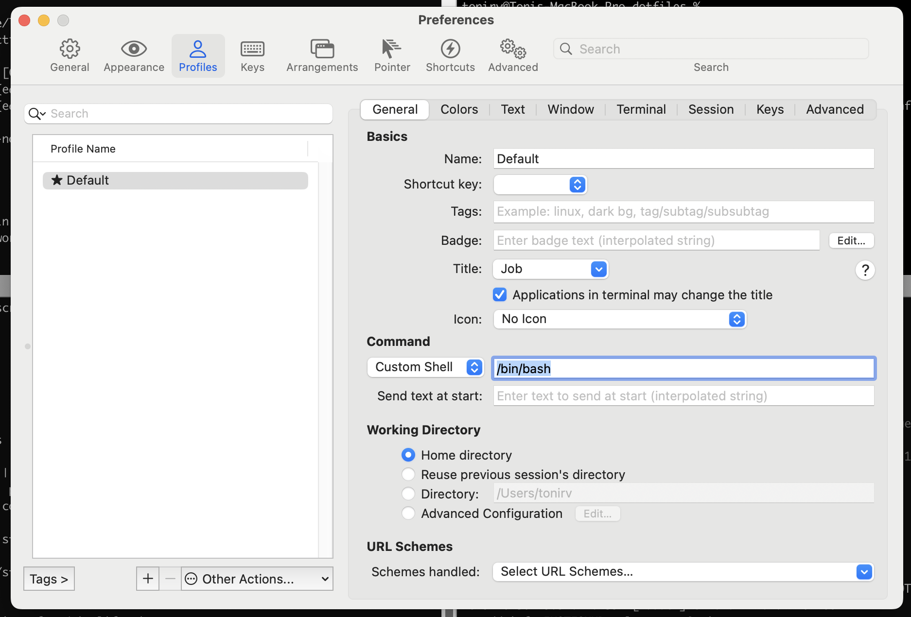

# My dotfiles

Meant for MacOS

Clone the repo: ```git clone git@github.com:ToniRV/dotfiles.git```

`git checkout MacOS/bash`

Backup your previous dotfiles:
```
mv ~/.bashrc ~/.bashrc_backup
mv ~/.bash_profile ~/.bash_profile_backup
mv ~/.gitconfig ~/.gitconfig_backup
mv ~/.inputrc ~/.inputrc_backup
mv ~/.vimrc ~/.vimrc_backup
```

Find and replace the [user] fields with your details in the ```gitconfig``` file:
```
[user]
  email = youremail
  name = yourname
```
Otherwise, you will see me as the author of your commits :) 

Install: 
```./install```

-> iTerm2 users need to set both the Regular font and the Non-ASCII Font in "iTerm > Preferences > Profiles > Text" to use a patched font (per this issue).

-> iTerm2 users need to manually set the `Command` setting in `Profile` to `/bin/bash` (see image below)



Delete your backup files if you do not need them anymore.

<!---
Install the fonts for the vim configs to work well:
https://github.com/powerline/fonts


<!---
To unset <Super>+t shortcut that pops the trash in ubuntu on Mac
sudo apt-get install compizconfig-settings-manager
Run CompizConfig, go to ubuntu Unity Plugin and change the Key to show the Dash, Launcher and Help Overlay from <Super>
to something like <Alt><Super>
<!---
Install [Vundle](https://github.com/VundleVim/Vundle.vim) to manage vim plugins
